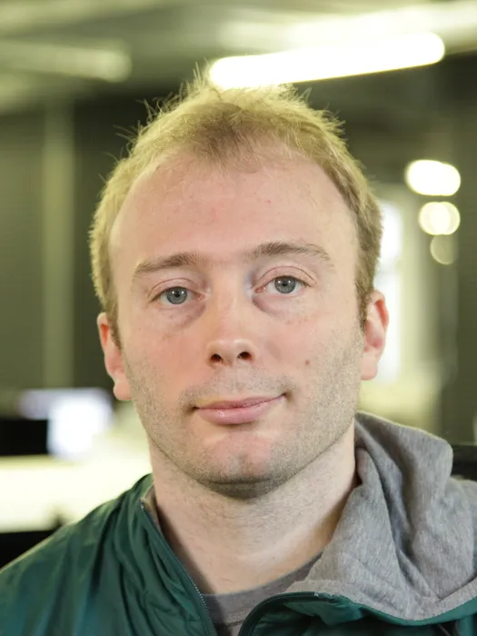

<section class="about-section">
    

        
        

            
        

        

            <h1>💡 À propos de moi</h1>
            
<strong>De l'École 42 à l'information mondiale.</strong>

            
            
Mon parcours est celui d'un passionné de défis. Aujourd'hui développeur à l'<strong>AFP (Agence France-Presse)</strong>, j'applique la rigueur acquise à l'École 42 au service d'une infrastructure d'information internationale.

            

                

                    <h3>🚀 Expertise Technique</h3>
                    
Alumni de 42, je maîtrise les fondamentaux du bas niveau (C/C++) et l'autonomie nécessaire pour dompter n'importe quel stack moderne.

                

                

                    <h3>🏅 Rigueur Olympique</h3>
                    
Mon expérience de chauffeur VVIP lors des <strong>JO de Paris 2024</strong> m'a appris la gestion du stress et la logistique de précision. Un bug est un obstacle, comme un embouteillage sur le périph' : il faut trouver la déviation la plus efficace.

                

                

                    <h3>🙏 Engagement Personnel</h3>
                    
Mon parcours de catéchumène reflète mes valeurs : intégrité, patience et une volonté constante de progresser.

                

            

            

                C / C++
                JavaScript
                PostgreSQL
                Docker
                AFP Ecosystem
            

        

    

</section>

